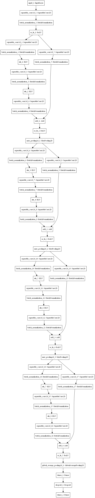
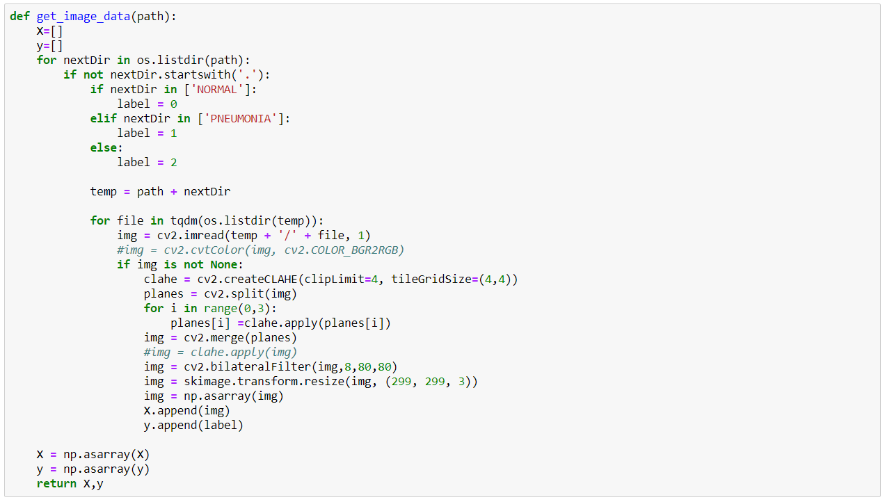
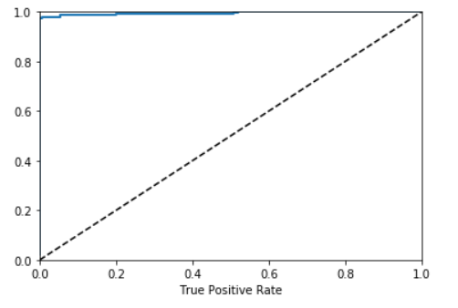
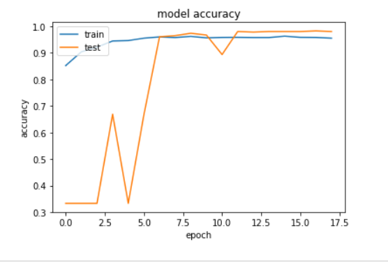
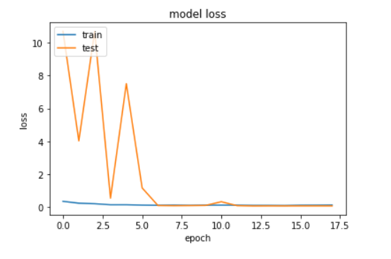
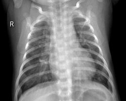
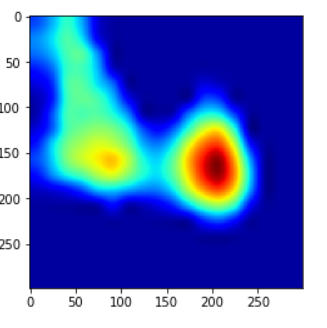

# Novel-method-for-pneumonia-detection-using-deep-residual-learning-along-with-separable-CNN
Pneumonia is an infectious disease that inflames the air sacs in the lungs. It may occur in one or both the lungs. The air sacs may fill with fluid or pus, causing cough followed by phlegm or pus, fever, chills and difficulty in breathing. The causes of pneumonia can be a variety of organisms such as bacteria, viruses and fungi. A person suffering from pneumonia apart from suffering from difficulty in respiration, can also suffer from other complications such as bacteremia, lung abscess, pleural effusion and among countless others. 
This model presents a efficient and enhanced method for diagnosis of pnuemonia using deep residual learning along with seperable convolutional networks. 
The images were CXR (Chest-X-ray images) in grayscale format obtained from the mendeley CXR data available at kaggle [Dataset Link](https://www.kaggle.com/parthachakraborty/pneumonia-chest-x-ray) 
The model developed using deep residual learning along with separable convolutional network is given below: 
 
This model was developed on a sample of 3000 images from the mendeley dataset which contained 5857 total images in grayscale format.
This proposed methodology gave an astonishing accuracy of 98.22 % along with an AUROC score of 99.515 resulting in it being one of the most efficient systems for diagnosis of pneumonia. 
# The Preprocessing 
The smapled dataset over which the model was trained contained 3000 images. The data or the images were read in BGR format allowing the learning of the model to be performed to 3 channels. Efficient edge preservation and enhancement techniques were applied including contrast adaptive histogram equalization(CLAHE) and bilateral filtering for precise preservation of the affected lesion in the CXR images. 
 
# The Model training and the proposed methodology 
The model is based on deep residual learning which reduces the complexity of the network to a much greater extent rather than normal sequential models. Moreover in case where the model gets too deep, residual learning provides better results incrementing the prediction ability of the model. The use of seperable convolutionalk network instead of simple convolutional network is to reduce the network complexity in terms of trainable parameters, time complexity and space complexity. 
The total parameters in this proposed methodology is 157,010 out of which 154,866 are trainable parameters. 
 
# The Residual block explanation 
 
def residual_block(mod_, f_in, f_out, strides_ = (1,1), use_shortcut_ = False):   
    shortcut_ = mod_
    
    k_ = (4,4)
    
    mod_ = SeparableConv2D(f_in, kernel_size=k_, strides=(1,1), padding = "same")(mod_)
    mod_ = BatchNormalization()(mod_)
    mod_ = ELU()(mod_)
    
    mod_ = SeparableConv2D(f_in, kernel_size=k_, strides=strides_, padding = "same")(mod_)
    mod_ = BatchNormalization()(mod_)
    mod_ = ELU()(mod_)
    
    mod_ = SeparableConv2D(f_out, kernel_size=k_, strides=(1,1), padding = "same")(mod_)
    mod_ = BatchNormalization()(mod_)
    
    if use_shortcut_ == True or strides_ != (1,1):
        shortcut_ = SeparableConv2D(f_out, kernel_size=k_, strides=strides_, padding = "same")(shortcut_)
        shortcut_ = BatchNormalization()(shortcut_)
        
    mod_ = Add()([shortcut_, mod_])
    mod_ = ReLU()(mod_)
    
    return mod_
 The above code is for Generating the Residual block containing 3 Separable convolutional blocks ouyt of which 2 have activation functions and the last layer is devoid of activation function which aids in reducing the complexity of the model further. 
 # The Evaluation of the model 
The Testing accuracy of the model is 98.2% evaluated on 15% of the sample data used for development of the model. 
The AUROC score is astoninshing which is 99.515 alon with the precision and recall to be 0.9965 and 0.9766 rrespectively. 
The Precision vs Recall curve is as follows:  
  
The following curve was generated using the following block of code:   
y_test_labels = np.argmax(y_test, axis = 1)  
y_test_pred_incep = np.argmax(model_f.predict(X_test),axis = 1)  
print(precision_score(y_test_labels, y_test_pred_incep))  
print(recall_score(y_test_labels, y_test_pred_incep))   
y_pred_probs = model_f.predict([X_test])  
fpr, tpr, thresholds = roc_curve(y_test_labels, y_pred_probs[:, 1])  
def plot_roc_curve(fpr, tpr, label = None):  
    plt.plot(fpr, tpr, linewidth=2, label = label)  
    plt.plot([0, 1], [0, 1], "k--")  
    plt.axis([0, 1, 0, 1])  
    plt.xlabel("False Positive Rate")  
    plt.xlabel("True Positive Rate")  
 
plot_roc_curve(fpr, tpr)  
plt.show()  
roc_auc_score(y_test_labels,y_pred_probs[:,1])  
The Training Curves including the accuracy curve and the loss curve are as follows:  
  
  
The following curves were generated using the following block of code:  
Training  
plt.plot(history['acc'])  
plt.plot(history['val_acc'])  
plt.title('Model accuracy')  
plt.ylabel('accuracy')  
plt.xlabel('epoch')  
plt.legend(['train', 'test'], loc='upper left')  
plt.show()  
Loss  
plt.plot(history['loss'])  
plt.plot(history['val_loss'])  
plt.title('model loss')  
plt.ylabel('loss')  
plt.xlabel('epoch')  
plt.legend(['train', 'test'], loc='upper left')  
plt.show()   
# The visualization of the model 
The visualization of the model was performed using the Grad-CAM mapping which clearly illustrated the affected lesion area of the CXR images. 
The visualization of a pirticular image helps in the efficacy of the evaluation of the model apart from using standard evaluation metrics. 
The output of the visualization of one of the images is as follows: 
  
 
-----------------------------------------------------The Proposed Methodology-----------------------------------------------------------
